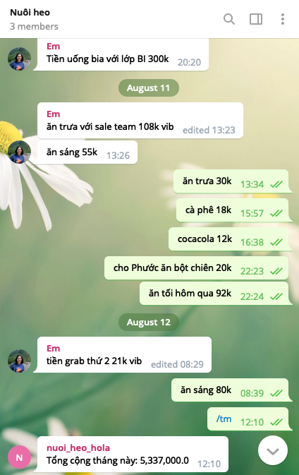

# l0qh4 - Telegram Bot
Học code python bằng PET project.

Những website tôi đã tham khảo trong quá trình thực hiện project này:
* https://docs.python.org/3
* https://www.php2python.com
* https://realpython.com

Tạo chat group trên telegram, add bot vào group. Ghi nhận chi tiêu bằng cách nhắn tin vào group, bot tự động lưu lại



## Tech stack
    * python
    * postgreSQL
    * linux

## Installation

1. Tạo telegram bot https://core.telegram.org/bots#3-how-do-i-create-a-bot

2. Tạo file `.env`
```
DATABASE_URL="postgresql://<user>:<password>@localhost:5432/<dbname>"
   
TELEGRAM_BOT_TOKEN="<bot-token>"
TELEGRAM_LOGGING_GROUP_ID="<telegram-group-id>"
```

3. Setup môi trường
```
$ python3 -m venv env
$ source env/bin/activate
$ pip install -r requirements.txt
```

4. Tạo db tables
```
$ python console.py initdb
```

5. Chạy bot
```
$ python bot.py
```
